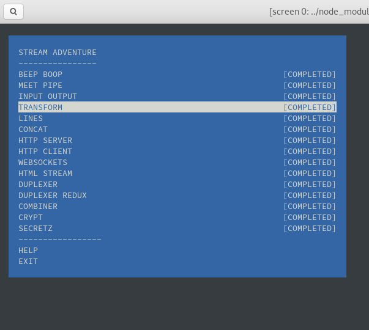

# [kottans-backend](https://github.com/kottans/backend/blob/master/contents.md)

`Stage 0. Self-Study:`

1. [Git Basics](#git-basics)
2. [Unix Shell](#unix-shell)
3. [Git for Team Collaboration](#git-for-team-collaboration)
4. [NodeJS Basics 1](#nodeJS-basics-1)
5. [Memory Management](#memory-management)
6. [TCP. UDP. Network](#tcp-udp-network)
7. [HTTP & HTTPs](#http--https)
8. [Patterns](#patterns)

---
### Git Basics

`<useful>` : <https://learngitbranching.js.org/>

`<useful>` : <https://lab.github.com/>

`<interesting>` : <https://www.webfx.com/blog/web-design/git-tips/>

`<interesting>` : <https://habr.com/ru/post/106912/>

`<the best :) >` : <https://guides.hexlet.io/learning/>

### Unix Shell


 `screenshot2:` [task_unix_shell](task_unix_shell/commandLineBycodeacademy.png)

- [x] [Linux Bash Shell Cheat Sheet](https://annawilliford.github.io/2016-04-02-UTA/workshop/Linux/bash_cheat_sheet.pdf)

- [x] `<good tutorial>` [Advanced Bash-Scripting Guide. An in-depth exploration of the art of shell scripting](http://www.tldp.org/LDP/abs/html/index.html)

- [x] [Configuring Linux Web Servers](https://www.udacity.com/course/configuring-linux-web-servers--ud299)

- [x] [The curl guide to HTTP requests](https://flaviocopes.com/http-curl/)

`<usefull>` [**zsh** instead bash](https://github.com/robbyrussell/oh-my-zsh)

### Git for Team Collaboration


`<Flight rules for Git>` : <https://github.com/k88hudson/git-flight-rules/blob/master/README.md>

### NodeJS Basics 1

[JavaScript Basics:](https://github.com/kottans/backend/blob/master/tasks/js_basics_1.md)

> - [x] [Intro to JS (udacity.com)](task_js_nodejs_basic/intro_to_js.png)

> - [x] basic-javascript(learn.freecodecamp.org)

> - [x] ES6(learn.freecodecamp.org)

[NodeSchool:](https://nodeschool.io/)




### Memory Management

<details><summary>Standard segment layout in a Linux process</summary>


1. The topmost segment in the process address space is the stack, which stores local variables and function parameters in most programming languages. Calling a method or function pushes a new stack frame onto the stack. The stack frame is destroyed when the function returns. This simple design, possible because the data obeys strict LIFO order, means that no complex data structure is needed to track stack contents - a simple pointer to the top of the stack will do. Pushing and popping are thus very fast and deterministic. Also, the constant reuse of stack regions tends to keep active stack memory in the cpu caches, speeding up access. Each thread in a process gets its own stack.   
It is possible to exhaust the area mapping the stack by pushing more data than it can fit. This triggers a page fault that is handled in Linux by expand_stack(), which in turn calls acct_stack_growth() to check whether it's appropriate to grow the stack. If the stack size is below RLIMIT_STACK (usually 8MB), then normally the stack grows and the program continues merrily, unaware of what just happened.   

2. Below the stack, we have the memory mapping segment. Here the kernel maps contents of files directly to memory. Any application can ask for such a mapping via the Linux mmap() system call (implementation) or CreateFileMapping() / MapViewOfFile() in Windows. Memory mapping is a convenient and high-performance way to do file I/O, so it is used for loading dynamic libraries. It is also possible to create an anonymous memory mapping that does not correspond to any files, being used instead for program data. In Linux, if you request a large block of memory via malloc(), the C library will create such an anonymous mapping instead of using heap memory. 'Large' means larger than MMAP_THRESHOLD bytes, 128 kB by default and adjustable via mallopt().

3. The heap provides runtime memory allocation, like the stack, meant for data that must outlive the function doing the allocation, unlike the stack. Most languages provide heap management to programs. Satisfying memory requests is thus a joint affair between the language runtime and the kernel.

    3.1. The Node.js heap is composed of two sections:New space,Old space. New allocations happen in new space, also known as younger generation. This is a small amount of memory from 1 to 8 megabytes. We can use the V8 engine parameter –max-old-space-size as shown below to raise the limit of heap memory. (`<source>` : <https://medium.com/@ashleydavis75/node-js-memory-limitations-30d3fe2664c0)>

4. BSS stores the contents of uninitialized static variables, whose values are not set by the programmer in source code. The BSS memory area is anonymous: it does not map any file. If you say static int cntActiveUsers, the contents of cntActiveUsers live in the BSS.

5. The data segment, holds the contents for static variables initialized in source code. This memory area is not anonymous. It maps the part of the program's binary image that contains the initial static values given in source code.

6. The contents of pointer gonzo - a 4-byte memory address - live in the data segment. The actual string it points to does not, however. The string lives in the text segment, which is read-only and stores all of your code in addition to tidbits like string literals. The text segment also maps your binary file in memory, but writes to this area earn your program a Segmentation Fault.

    


    `<source>` : <https://manybutfinite.com/post/anatomy-of-a-program-in-memory/>

</details>

`<Finding And Fixing Node.js Memory Leaks: A Practical Guide>` : <https://marmelab.com/blog/2018/04/03/how-to-track-and-fix-memory-leak-with-nodejs.html#accessing-nodejs-memory-using-v8-inspector--chrome-dev-tools>

> ### What's going to happen if program reaches maximum limit of stack ?
 >> If the maximum stack size has been reached, we have a stack overflow and the program receives a Segmentation Fault. While the mapped stack area expands to meet demand, it does not shrink back when the stack gets smaller.   
> ### What's going to happen if program requests a big (more then 128KB) memory allocation on heap ?
 >>The heap is enlarged via the brk() system call (implementation) to make room for the requested block.
> ### What's the difference between Text and Data memory segments ?
 >> Data segment maps the part of the program's binary image that contains the initial static values given in source code and text segment stores the binary image of the process.
  
  <details><summary> cat /proc/[pid]/maps </summary>
  
```
55bcfc664000-55bcfc67b000 r--p 00000000 08:01 3818677                    /usr/bin/zsh
55bcfc67b000-55bcfc70f000 r-xp 00017000 08:01 3818677                    /usr/bin/zsh
55bcfc70f000-55bcfc731000 r--p 000ab000 08:01 3818677                    /usr/bin/zsh
55bcfc731000-55bcfc733000 r--p 000cc000 08:01 3818677                    /usr/bin/zsh
55bcfc733000-55bcfc739000 rw-p 000ce000 08:01 3818677                    /usr/bin/zsh
55bcfc739000-55bcfc74d000 rw-p 00000000 00:00 0 
55bcfdda4000-55bcfdf7b000 rw-p 00000000 00:00 0                          [heap]
7f7ad2aa6000-7f7ad2aa9000 r--p 00000000 08:01 400858                     /usr/lib64/zsh/5.7.1/zsh/computil.so
7f7ad2aa9000-7f7ad2ab6000 r-xp 00003000 08:01 400858                     /usr/lib64/zsh/5.7.1/zsh/computil.so
7f7ad2ab6000-7f7ad2ab8000 r--p 00010000 08:01 400858                     /usr/lib64/zsh/5.7.1/zsh/computil.so
7f7ad2ab8000-7f7ad2ab9000 r--p 00011000 08:01 400858                     /usr/lib64/zsh/5.7.1/zsh/computil.so
7f7ad2ab9000-7f7ad2aba000 rw-p 00012000 08:01 400858                     /usr/lib64/zsh/5.7.1/zsh/computil.so
7f7ad2ade000-7f7ad2ae2000 r--p 00000000 08:01 400855                     /usr/lib64/zsh/5.7.1/zsh/complist.so
7f7ad2ae2000-7f7ad2aed000 r-xp 00004000 08:01 400855                     /usr/lib64/zsh/5.7.1/zsh/complist.so
7f7ad2aed000-7f7ad2aee000 r--p 0000f000 08:01 400855                     /usr/lib64/zsh/5.7.1/zsh/complist.so
7f7ad2aee000-7f7ad2aef000 ---p 00010000 08:01 400855                     /usr/lib64/zsh/5.7.1/zsh/complist.so
7f7ad2aef000-7f7ad2af0000 r--p 00010000 08:01 400855                     /usr/lib64/zsh/5.7.1/zsh/complist.so
7f7ad2af0000-7f7ad2af1000 rw-p 00011000 08:01 400855                     /usr/lib64/zsh/5.7.1/zsh/complist.so
7f7ad2af1000-7f7ad2af3000 r--p 00000000 08:01 400081                     /usr/lib64/zsh/5.7.1/zsh/zutil.so
7f7ad2af3000-7f7ad2af8000 r-xp 00002000 08:01 400081                     /usr/lib64/zsh/5.7.1/zsh/zutil.so
7f7ad2af8000-7f7ad2af9000 r--p 00007000 08:01 400081                     /usr/lib64/zsh/5.7.1/zsh/zutil.so
7f7ad2af9000-7f7ad2afa000 ---p 00008000 08:01 400081                     /usr/lib64/zsh/5.7.1/zsh/zutil.so
7f7ad2afa000-7f7ad2afb000 r--p 00008000 08:01 400081                     /usr/lib64/zsh/5.7.1/zsh/zutil.so
7f7ad2afb000-7f7ad2afc000 rw-p 00009000 08:01 400081                     /usr/lib64/zsh/5.7.1/zsh/zutil.so
7f7ad2afc000-7f7ad2b04000 r--p 00000000 08:01 400046                     /usr/lib64/zsh/5.7.1/zsh/complete.so
7f7ad2b04000-7f7ad2b1e000 r-xp 00008000 08:01 400046                     /usr/lib64/zsh/5.7.1/zsh/complete.so
7f7ad2b1e000-7f7ad2b21000 r--p 00022000 08:01 400046                     /usr/lib64/zsh/5.7.1/zsh/complete.so
7f7ad2b21000-7f7ad2b23000 r--p 00024000 08:01 400046                     /usr/lib64/zsh/5.7.1/zsh/complete.so
7f7ad2b23000-7f7ad2b24000 rw-p 00026000 08:01 400046                     /usr/lib64/zsh/5.7.1/zsh/complete.so
7f7ad2b24000-7f7ad2b27000 r--p 00000000 08:01 400066                     /usr/lib64/zsh/5.7.1/zsh/parameter.so
7f7ad2b27000-7f7ad2b2c000 r-xp 00003000 08:01 400066                     /usr/lib64/zsh/5.7.1/zsh/parameter.so
7f7ad2b2c000-7f7ad2b2e000 r--p 00008000 08:01 400066                     /usr/lib64/zsh/5.7.1/zsh/parameter.so
7f7ad2b2e000-7f7ad2b2f000 ---p 0000a000 08:01 400066                     /usr/lib64/zsh/5.7.1/zsh/parameter.so
7f7ad2b2f000-7f7ad2b30000 r--p 0000a000 08:01 400066                     /usr/lib64/zsh/5.7.1/zsh/parameter.so
7f7ad2b30000-7f7ad2b31000 rw-p 0000b000 08:01 400066                     /usr/lib64/zsh/5.7.1/zsh/parameter.so
7f7ad2b31000-7f7ad2b48000 r--p 00000000 08:01 400076                     /usr/lib64/zsh/5.7.1/zsh/zle.so
7f7ad2b48000-7f7ad2b73000 r-xp 00017000 08:01 400076                     /usr/lib64/zsh/5.7.1/zsh/zle.so
7f7ad2b73000-7f7ad2b7c000 r--p 00042000 08:01 400076                     /usr/lib64/zsh/5.7.1/zsh/zle.so
7f7ad2b7c000-7f7ad2b7d000 ---p 0004b000 08:01 400076                     /usr/lib64/zsh/5.7.1/zsh/zle.so
7f7ad2b7d000-7f7ad2b7f000 r--p 0004b000 08:01 400076                     /usr/lib64/zsh/5.7.1/zsh/zle.so
7f7ad2b7f000-7f7ad2b86000 rw-p 0004d000 08:01 400076                     /usr/lib64/zsh/5.7.1/zsh/zle.so
7f7ad2b86000-7f7ad2b87000 rw-p 00000000 00:00 0 
7f7ad2b87000-7f7ad338c000 r--s 00000000 08:01 524423                     /var/lib/sss/mc/passwd
7f7ad338c000-7f7ad338e000 r--p 00000000 08:01 3817198                    /usr/lib64/libnss_sss.so.2
7f7ad338e000-7f7ad3394000 r-xp 00002000 08:01 3817198                    /usr/lib64/libnss_sss.so.2
7f7ad3394000-7f7ad3396000 r--p 00008000 08:01 3817198                    /usr/lib64/libnss_sss.so.2
7f7ad3396000-7f7ad3397000 r--p 00009000 08:01 3817198                    /usr/lib64/libnss_sss.so.2
7f7ad3397000-7f7ad3398000 rw-p 0000a000 08:01 3817198                    /usr/lib64/libnss_sss.so.2
7f7ad3398000-7f7ae0342000 r--p 00000000 08:01 3801127                    /usr/lib/locale/locale-archive
7f7ae0342000-7f7ae0347000 rw-p 00000000 00:00 0 
7f7ae0347000-7f7ae034d000 r--p 00000000 08:01 3801561                    /usr/lib64/libpthread-2.29.so
7f7ae034d000-7f7ae035c000 r-xp 00006000 08:01 3801561                    /usr/lib64/libpthread-2.29.so
7f7ae035c000-7f7ae0362000 r--p 00015000 08:01 3801561                    /usr/lib64/libpthread-2.29.so
7f7ae0362000-7f7ae0363000 r--p 0001a000 08:01 3801561                    /usr/lib64/libpthread-2.29.so
7f7ae0363000-7f7ae0364000 rw-p 0001b000 08:01 3801561                    /usr/lib64/libpthread-2.29.so
7f7ae0364000-7f7ae0368000 rw-p 00000000 00:00 0 
7f7ae0368000-7f7ae038a000 r--p 00000000 08:01 3801452                    /usr/lib64/libc-2.29.so
7f7ae038a000-7f7ae04d7000 r-xp 00022000 08:01 3801452                    /usr/lib64/libc-2.29.so
7f7ae04d7000-7f7ae0523000 r--p 0016f000 08:01 3801452                    /usr/lib64/libc-2.29.so
7f7ae0523000-7f7ae0524000 ---p 001bb000 08:01 3801452                    /usr/lib64/libc-2.29.so
7f7ae0524000-7f7ae0528000 r--p 001bb000 08:01 3801452                    /usr/lib64/libc-2.29.so
7f7ae0528000-7f7ae052a000 rw-p 001bf000 08:01 3801452                    /usr/lib64/libc-2.29.so
7f7ae052a000-7f7ae052e000 rw-p 00000000 00:00 0 
7f7ae052e000-7f7ae053b000 r--p 00000000 08:01 3801505                    /usr/lib64/libm-2.29.so
7f7ae053b000-7f7ae05d7000 r-xp 0000d000 08:01 3801505                    /usr/lib64/libm-2.29.so
7f7ae05d7000-7f7ae0672000 r--p 000a9000 08:01 3801505                    /usr/lib64/libm-2.29.so
7f7ae0672000-7f7ae0673000 r--p 00143000 08:01 3801505                    /usr/lib64/libm-2.29.so
7f7ae0673000-7f7ae0674000 rw-p 00144000 08:01 3801505                    /usr/lib64/libm-2.29.so
7f7ae0674000-7f7ae0676000 r--p 00000000 08:01 3801612                    /usr/lib64/librt-2.29.so
7f7ae0676000-7f7ae067a000 r-xp 00002000 08:01 3801612                    /usr/lib64/librt-2.29.so
7f7ae067a000-7f7ae067c000 r--p 00006000 08:01 3801612                    /usr/lib64/librt-2.29.so
7f7ae067c000-7f7ae067d000 r--p 00007000 08:01 3801612                    /usr/lib64/librt-2.29.so
7f7ae067d000-7f7ae067e000 rw-p 00008000 08:01 3801612                    /usr/lib64/librt-2.29.so
7f7ae067e000-7f7ae068c000 r--p 00000000 08:01 3809222                    /usr/lib64/libtinfo.so.6.1
7f7ae068c000-7f7ae069b000 r-xp 0000e000 08:01 3809222                    /usr/lib64/libtinfo.so.6.1
7f7ae069b000-7f7ae06a8000 r--p 0001d000 08:01 3809222                    /usr/lib64/libtinfo.so.6.1
7f7ae06a8000-7f7ae06ac000 r--p 00029000 08:01 3809222                    /usr/lib64/libtinfo.so.6.1
7f7ae06ac000-7f7ae06ad000 rw-p 0002d000 08:01 3809222                    /usr/lib64/libtinfo.so.6.1
7f7ae06ad000-7f7ae06ae000 r--p 00000000 08:01 3801481                    /usr/lib64/libdl-2.29.so
7f7ae06ae000-7f7ae06b0000 r-xp 00001000 08:01 3801481                    /usr/lib64/libdl-2.29.so
7f7ae06b0000-7f7ae06b1000 r--p 00003000 08:01 3801481                    /usr/lib64/libdl-2.29.so
7f7ae06b1000-7f7ae06b2000 r--p 00003000 08:01 3801481                    /usr/lib64/libdl-2.29.so
7f7ae06b2000-7f7ae06b3000 rw-p 00004000 08:01 3801481                    /usr/lib64/libdl-2.29.so
7f7ae06b3000-7f7ae06b5000 rw-p 00000000 00:00 0 
7f7ae06b8000-7f7ae06b9000 r--p 00000000 08:01 400068                     /usr/lib64/zsh/5.7.1/zsh/regex.so
7f7ae06b9000-7f7ae06ba000 r-xp 00001000 08:01 400068                     /usr/lib64/zsh/5.7.1/zsh/regex.so
7f7ae06ba000-7f7ae06bb000 r--p 00002000 08:01 400068                     /usr/lib64/zsh/5.7.1/zsh/regex.so
7f7ae06bb000-7f7ae06bc000 r--p 00002000 08:01 400068                     /usr/lib64/zsh/5.7.1/zsh/regex.so
7f7ae06bc000-7f7ae06bd000 rw-p 00003000 08:01 400068                     /usr/lib64/zsh/5.7.1/zsh/regex.so
7f7ae06bf000-7f7ae06c0000 r--p 00000000 08:01 400074                     /usr/lib64/zsh/5.7.1/zsh/terminfo.so
7f7ae06c0000-7f7ae06c1000 r-xp 00001000 08:01 400074                     /usr/lib64/zsh/5.7.1/zsh/terminfo.so
7f7ae06c1000-7f7ae06c2000 r--p 00002000 08:01 400074                     /usr/lib64/zsh/5.7.1/zsh/terminfo.so
7f7ae06c2000-7f7ae06c3000 r--p 00002000 08:01 400074                     /usr/lib64/zsh/5.7.1/zsh/terminfo.so
7f7ae06c3000-7f7ae06c4000 rw-p 00003000 08:01 400074                     /usr/lib64/zsh/5.7.1/zsh/terminfo.so
7f7ae06c4000-7f7ae06c5000 r--p 00000000 08:01 400056                     /usr/lib64/zsh/5.7.1/zsh/langinfo.so
7f7ae06c5000-7f7ae06c6000 r-xp 00001000 08:01 400056                     /usr/lib64/zsh/5.7.1/zsh/langinfo.so
7f7ae06c6000-7f7ae06c7000 r--p 00002000 08:01 400056                     /usr/lib64/zsh/5.7.1/zsh/langinfo.so
7f7ae06c7000-7f7ae06c8000 r--p 00002000 08:01 400056                     /usr/lib64/zsh/5.7.1/zsh/langinfo.so
7f7ae06c8000-7f7ae06c9000 rw-p 00003000 08:01 400056                     /usr/lib64/zsh/5.7.1/zsh/langinfo.so
7f7ae06c9000-7f7ae06d0000 r--s 00000000 08:01 4328195                    /usr/lib64/gconv/gconv-modules.cache
7f7ae06d0000-7f7ae06d4000 rw-p 00000000 00:00 0 
7f7ae06d4000-7f7ae06d5000 r--p 00000000 08:01 3803682                    /usr/lib64/ld-2.29.so
7f7ae06d5000-7f7ae06f5000 r-xp 00001000 08:01 3803682                    /usr/lib64/ld-2.29.so
7f7ae06f5000-7f7ae06fd000 r--p 00021000 08:01 3803682                    /usr/lib64/ld-2.29.so
7f7ae06fe000-7f7ae06ff000 r--p 00029000 08:01 3803682                    /usr/lib64/ld-2.29.so
7f7ae06ff000-7f7ae0700000 rw-p 0002a000 08:01 3803682                    /usr/lib64/ld-2.29.so
7f7ae0700000-7f7ae0701000 rw-p 00000000 00:00 0 
7ffde01c1000-7ffde0225000 rw-p 00000000 00:00 0                          [stack]
7ffde0287000-7ffde028a000 r--p 00000000 00:00 0                          [vvar]
7ffde028a000-7ffde028b000 r-xp 00000000 00:00 0                          [vdso]
ffffffffff600000-ffffffffff601000 r-xp 00000000 00:00 0                  [vsyscall]

```
</details>

Heap - 55bcfdda4000-55bcfdf7b000 , Stack - 7ffde01c1000-7ffde0225000, MMS - 7f7ad2aa6000-7f7ad2aa9000

### TCP. UDP. Network


- [x] [How DNS Works](https://howdns.works/)

- [ ] [Port Sniffer Task](https://github.com/616e44/nodejs-2019-homeworks/blob/port-sniffer/submissions/anD/port-sniffer/sniffer.js)

### HTTP & HTTPs

    curl https://api.github.com/users/616e44
    
    curl -i https://api.github.com/users/616e44         // -i flag to include headers
   
    curl --user 616e44 https://api.github.com/gists/starred
    
    curl --user 616e44:*** https://api.github.com/gists/starred
    
    curl https://api.github.com/users/kottans/repos | grep -w full_name
    
    ------------------------------------------          // add new issue 

    curl -i -H 'Authorization: token ***' \
       -d '{ \
            "title": "add new issue using github API", \
            "body": "Create new issue in your repository", \
            "labels": ["good first issue"] \
          }' \
       https://api.github.com/repos/616e44/kottans-backend/issues
       
    ------------------------------------------
    curl -i --user 616e44 -X POST -d '{"title": "Add new issue using github API","body": "Create new issue in your repository","labels": ["good first issue"]}' https://api.github.com/repos/616e44/kottans-backend/issues

[GitHub API documentation](https://developer.github.com/v3/guides/getting-started)

[An introduction to curl using GitHub's API](https://gist.github.com/joyrexus/85bf6b02979d8a7b0308)


### [Questions](https://github.com/kottans/backend/blob/master/tasks/http.md#questions)
### `№1:`   
- privacy  - someone can eavesdrop on the message.

- integrity -  the message can be modified on the way to its destination.
 
- identification - the owner of the message cannot be identified
 
### `№2:`

- In public key cryptography, each party has two keys, a public key and a private key. 
  Information encrypted with a person's public key can only be decrypted with the private key and vice versa.
  Each user publicly tells the world what his public key is but keeps his private key for himself.
    
### `№3:`

       1. curl -X POST -H "Content-Type application/json" -d '{"pet_name":"name",""age":2, "medical_history":"description" ....}' http://host.domain:port/pets   
        // [....,{"pet_name":"name",""age":2, "medical_history":"description" ...}]
       
       2. curl http://host.domain:port/pets/petsName
       // [{"pet_name": "someName", "age": 2, "owner": "owner's name" ....}]
       
       3. curl -X PUT -H "Content-Type application/json" -d '{"pet_name" = newName}' http://host.domain:port/pets/pet_name
       // [{"pet_name": "NewName", "age": 2, "owner": "owner's name" ....}]
       
       4. curl -X PUT -H "Content-Type application/json" -d '{"medical_history":"new description"}' http://host.domain:port/pets/pet_name
       // [{"pet_name":"name",""age":2, "medical_history":"old description + new description",...}]
       
       5. curl -X PUT -H "Content-Type application/json" -d '{"doctor":"name"}' http://host.domain:port/pets/pet_name
       // [{"pet_name":"name",""age":2, "medical_history":"old description + new description", "doctor": "name", ...}]
                 
       6. if pet exist  
                  curl -X PUT -H "Content-Type application/json" -d '{"doctor":"name", "date": Data}' http://host.domain:port/pets/pet_name
           else 
                  1.  
### Patterns

- [10 Common Software Architectural Patterns in a nutshell](https://towardsdatascience.com/10-common-software-architectural-patterns-in-a-nutshell-a0b47a1e9013)

- [design-patterns-for-humans](https://github.com/kamranahmedse/design-patterns-for-humans)

- [Software Architecture Guide](https://www.martinfowler.com/architecture/)

